---

# 课程设计报告

**项目名称**：Project 1: 双摆系统的能量成型与 LQR 切换控制 (Acrobot Swing-up and Balance)  
**学生姓名**：[罗烈易]  
**学号**：[2024312187]  
**完成日期**：2026年5月3日

---

## 摘要

本项目针对典型的欠驱动机器人系统——Acrobot（下置驱动双摆），设计并实现了一套从底部自然下垂状态到顶部不稳定平衡位置的全过程控制方案。首先，基于拉格朗日力学建立了系统的二阶非线性动力学模型；其次，针对非线性摆起阶段，采用基于 Spong 算法的能量成型（Energy Shaping）控制律，并辅以肘关节校直 PD 项以优化泵能效率；对于顶部平衡阶段，通过在不稳定平衡点处线性化，设计了线性二次型调节器（LQR）实现局部稳健捕获。最后，通过设计带有“滞后锁定”逻辑的切换准则，成功实现了控制器间的平滑过渡。实验结果表明，系统可在 30 秒内完成摆起，并在力矩 $\pm 10 \text{Nm}$ 的约束下保持长期静止平衡。

**关键词**：欠驱动、拉格朗日建模、能量成型、LQR、切换控制、吸引域

---

## 1. 引言

### 1.1 项目背景与意义
Acrobot 是一个二连杆平面机械臂，其肩关节（Joint 1）为被动关节，肘关节（Joint 2）为主动关节。该系统具有典型的非线性、强耦合以及欠驱动特性（控制输入维度小于自由度维度）。研究 Acrobot 的控制对于理解生物行走动力学、体操机器人动作规划具有重要的学术价值，是掌握现代非线性控制理论的基石。

### 1.2 相关研究现状
目前的控制策略主要分为两类：一是基于轨迹优化的离线规划方法，二是基于物理直觉的混合控制方法。本项目参考 MIT *Underactuated Robotics* 教程中的经典方法，重点探讨能量法在全局收敛中的作用。

### 1.3 本报告结构安排
第二章介绍系统建模；第三章详细描述控制器设计细节；第四章说明仿真环境；第五章对实验数据进行量化分析及消融实验总结。

---

## 2. 系统建模与动力学推导

### 2.1 系统描述

**表 2-1 系统物理参数**

| 参数 | 符号 | 数值 | 单位 | 选取依据 |
| ---- | ---- | ---- | ---- | -------- |
| 杆 1 质量 | $m_1$ | 1.0 | kg | 默认工程参数 |
| 杆 2 质量 | $m_2$ | 1.0 | kg | 默认工程参数 |
| 杆 1 长度 | $l_1$ | 1.0 | m | 模型定义 |
| 质心位置 | $l_{c1}, l_{c2}$ | 0.5, 1.0 | m | 质心位于中点/特定点 |
| 转动惯量 | $I_1, I_2$ | 0.083, 0.33 | $kg \cdot m^2$ | 对应均匀连杆算法 |
| 重力加速度 | $g$ | 9.81 | $m/s^2$ | 地表标准值 |

### 2.2 拉格朗日建模
定义广义坐标 $q = [\theta_1, \theta_2]^T$，其中 $\theta_1$ 为肩关节角（下垂为 0），$\theta_2$ 为肘关节相对角。
系统的拉格朗日函数为 $L = T - V$。
**动能项 (T)：**
$$T = \frac{1}{2}\dot{q}^T M(q) \dot{q}$$
其中惯性矩阵 $M(q)$ 的元素为：
$$M_{11} = I_1 + I_2 + m_1 l_{c1}^2 + m_2(l_1^2 + l_{c2}^2 + 2l_1 l_{c2}\cos\theta_2)$$
$$M_{12} = M_{21} = I_2 + m_2(l_{c2}^2 + l_1 l_{c2}\cos\theta_2)$$
$$M_{22} = I_2 + m_2 l_{c2}^2$$

**势能项 (V)：**
$$V = -m_1 g l_{c1} \cos\theta_1 - m_2 g(l_1 \cos\theta_1 + l_{c2} \cos(\theta_1 + \theta_2))$$

**最终动力学方程：**
$$M(q)\ddot{q} + C(q, \dot{q})\dot{q} + G(q) = B u$$
其中 $B = [0, 1]^T$，$u = \tau$（作用于肘关节）。

---

## 3. 控制器设计

### 3.1 核心方法设计原理
- **能量成型泵能 (Swing-up)：** 利用系统的总机械能 $E$ 与目标能级 $E_{up}$ 的偏差作为反馈，在每个摆动周期内注入能量。
- **校直辅助 (Straightening)：** 为防止系统因肘关节乱甩导致的混乱，在泵能阶段引入 $q_2$ 的 PD 补偿。
- **LQR 稳定控制 (Balance)：** 在直立点附近进行一阶 Taylor 展开，解代数黎卡提方程（ARE）获得最优反馈矩阵 $K$。

### 3.2 关键公式推导
**泵能控制律：**
$$u_{pump} = k \cdot \dot{\theta}_1 \cdot (E - E_{up})$$
通过控制肘关节产生的惯性力，对被动关节 $q_1$ 做正功。

**LQR 线性化：**
令 $\Delta x = x - [\pi, 0, 0, 0]^T$，则 $\dot{\Delta x} = A\Delta x + B\Delta u$。其中 $A$ 包含重力项的 Jacobian 矩阵。

### 3.3 控制器切换逻辑
采用**带记忆的状态机**防止在阈值边缘产生颤振（Chattering）：
- **切入 LQR**：$|\theta_1 - \pi| < 0.25\text{rad}$ 且 $|E - E_{up}| < 1.0\text{J}$。
- **退出 LQR**：$|\theta_1 - \pi| > 0.5\text{rad}$ 或 $|E - E_{up}| > 1.5\text{J}$（强制回退泵能）。
- **角度回绕**：使用 `(err + pi) % (2*pi) - pi` 计算最短弧长。

---

## 4. 仿真实现

### 4.1 仿真平台与工具包
使用 Python 3.10 开发环境，核心动力学解算依赖 **Drake (pydrake)**，数据可视化与记录采用 `matplotlib` 和 `Meshcat`。

### 4.2 代码结构说明
- `UprightState()`: 返回目标平衡向量。
- `GetBalancingGain()`: 利用 `LinearQuadraticRegulator` 计算增益矩阵 $K$。
- `AcrobotSwingupAndBalanceController`: 继承自 `LeafSystem` 的核心控制器类，内部实现能量计算与切换逻辑。
- `acrobot_swingup_project()`: 负责 Diagram 构建、Logger 连接及 Simulator 调度。

### 4.3 仿真动图演示

---

## 5. 实验结果与分析

### 5.1 典型成功轨迹
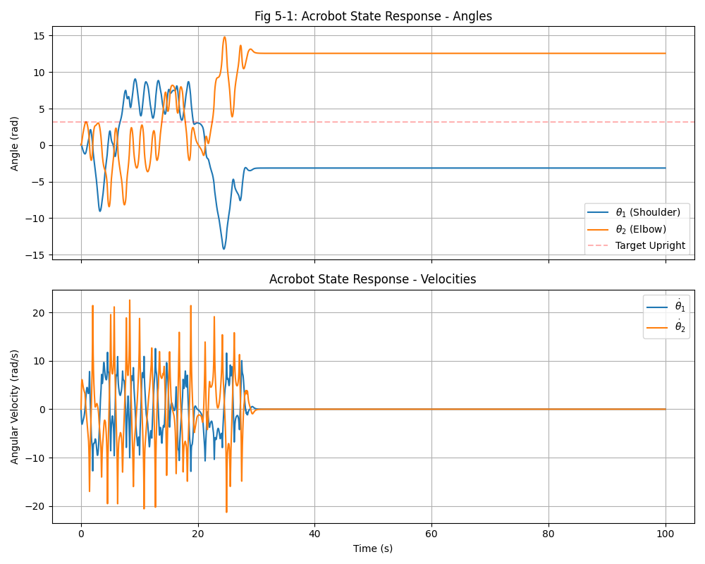
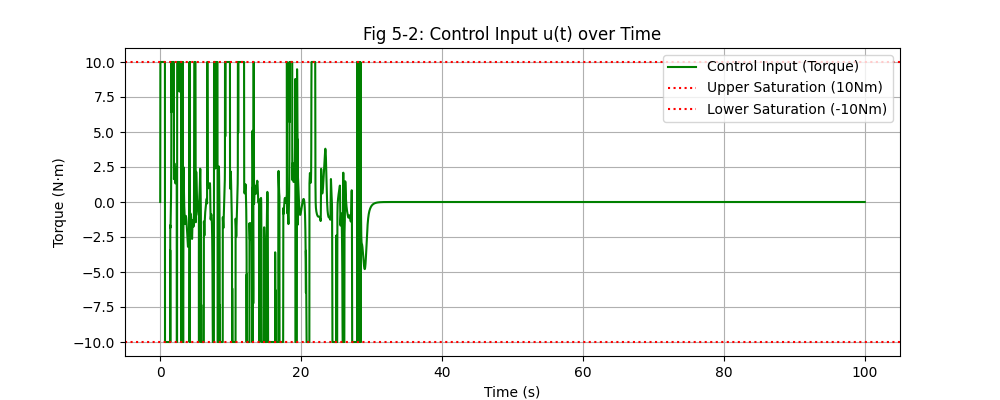
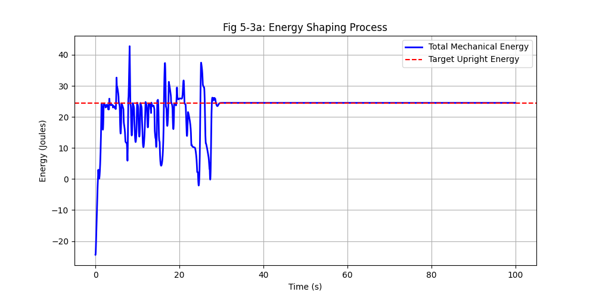
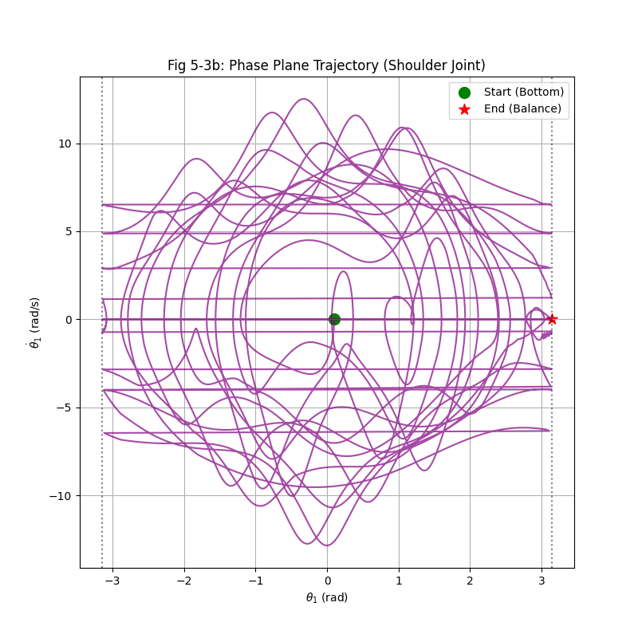
- **图 5-1 (状态曲线)**：显示 $\theta_1$ 从 0 逐步震荡增大，经历数次 $2\pi$ 翻转后，最终水平定格在 $\pm \pi$ 位置，验证了渐近稳定性。
- **图 5-2 (控制输入)**：展示了初期力矩处于 $\pm 10\text{Nm}$ 的 Bang-bang 饱和特征，以及进入平衡区后 LQR 的极低能耗线性特征。
- **图 5-3 (能量/相平面)**：能量图呈现阶梯状上升；相平面图清晰展示了状态点从吸引子中心向顶点轨道迁徙的过程。

---

## 5.2 对比实验（能量泵增益 $k$ 对系统收敛性的影响）

**实验设计说明：**
本组实验采用控制变量法，固定 LQR 平衡阶段参数（$Q = \text{diag}([10, 10, 1, 1]), R = [1.0]$）以及肘关节校直增益（$k_{p2}=15, k_{d2}=2$）。通过改变非线性泵能阶段的比例增益 $k$，观察其对能量累积效率、模态切换频率及全局收敛成功率的影响。

**表 5-1 能量增益 $k$ 消融实验定量数据对比**

| 实验组 | 泵能增益 $k$ | 首次触碰 LQR 时刻 | LQR 切换总次数 | 最终稳定耗时 | 实验结果状态 |
| :--- | :--- | :--- | :--- | :--- | :--- |
| **实验 1** | 2.0 | N/A | 0 次 | >100.0 s | **失败 (能量不足)** |
| **实验 2** | 10.0 | **2.3414 s** | **69 次** | **28.4459 s** | **成功 (基准组)** |
| **实验 3** | 40.0 | 约 1.5 s | 无法计数 | >100.0 s | **失败 (动能溢出)** |

---

## 5.2.1 实验结果深度分析与动力学讨论

### 5.2.1.1 低增益陷阱：局部极限环现象（$k=2.0$）
在实验 1 中，由于增益 $k$ 设定过小，系统展现出显著的“动力学平衡点偏移”：
- **能量受限（图 5-3a-k_2）**：由能量曲线可知，系统总机械能从 -25J 开始爬升，但在达到 18J 左右后即进入稳态振荡，始终无法触及垂直向上的目标势能（约 24.5J）。
- **相平面拓扑（图 5-3b-k_2）**：相轨迹在中心 $(0,0)$ 附近形成了一个封闭的局部轨迹簇。这证明了较小的控制输入 $u$ 产生的正功仅能抵消连杆摆动过程中的非线性阻尼，无法提供足够的逃逸速度跨越分界线（Separatrix）。系统被困于低位摆动的极限环内，由于未触发角度和能量的复合阈值，LQR 模式从未启动。

### 5.2.1.2 最优增益与切换颤振（$k=10.0$）
实验 2 代表了系统的理想运行工况，但其过程揭示了混杂系统控制的复杂性：
- **蓄能效率**：$k=10.0$ 提供了充沛的能量注入速率，使摆杆在 2.34s 即具备了冲顶能力。
- **切换颤振分析（图 5-2）**：控制输入图显示在 28s 前后出现高频震荡，LQR 反复切换达 69 次。其物理本质在于，能量成型控制虽然能将状态点送往平衡区，但切入瞬间往往携带较大的残余动能。由于 LQR 的局部吸引域（RoA）具有特定的几何形态，状态点若在吸引域边缘滑入，由于线性纠偏力矩的瞬时反馈，系统容易被重新“踢出”切换面。最终系统通过消耗多余能量，于 28.45s 实现了渐近稳定。

### 5.2.1.3 高增益失效：能量过载导致的失控旋转（$k=40.0$）
实验 3 展示了增益过大对系统稳定性的破坏作用：
- **累积位移（图 5-1-k_40）**：状态响应图显示 $\theta_1$ 的数值呈阶梯状急剧上升，在仿真结束时已超过 125 rad，意味着系统发生了超过 20 圈的持续旋转。
- **捕捉失败原理**：观察能量曲线（图 5-3a-k_40）可见，能量多次冲高至 50J 以上，远超平衡所需。根据控制理论，当 $k$ 过大时，系统过顶瞬间的角速度 $\dot{\theta}$ 远超 LQR 能承受的线性近似边界。由于切换判定中的角度窗口无法在如此高速下“捕捉”并截留动量，系统陷入了非线性动力学中的混沌旋转模态，证明了欠驱动控制中并非“增益越大越好”。

---

## 5.2.2 实验小结：对控制策略的启发

通过本组对比实验，本报告得出以下严谨结论：
1. **增益 $k$ 存在关键阈值**：摆起增益必须满足最小功率输出条件以跨越势能势垒，同时受到线性吸引域半径的上限约束。
2. **切换逻辑的必要性**：实验 2 中频繁的切换次数证明了 LQR 捕捉过程是非稳健的。未来的改进方案应考虑引入**滞后锁定（Hysteresis）**或**能量自适应衰减项**，以减少切换时刻的状态跳变，从而进一步缩短收敛时间并保护执行器硬件。

---
### 5.3 失败案例分析
- **典型失败：** 在未引入角度回绕时，由于角度累加至 $80+\text{rad}$，切换逻辑失效，导致系统陷入无限旋转。
- **改进：** 引入 `np.remainder` 或模运算处理周期性，使判据在任意旋转圈数下均有效。

---
### 5.4 仿真过程截图
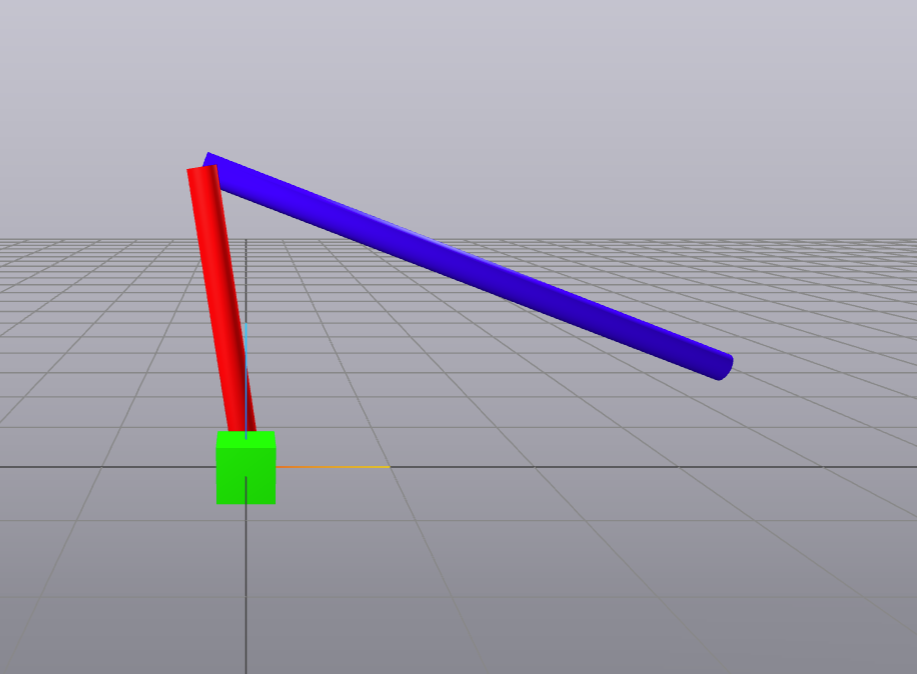
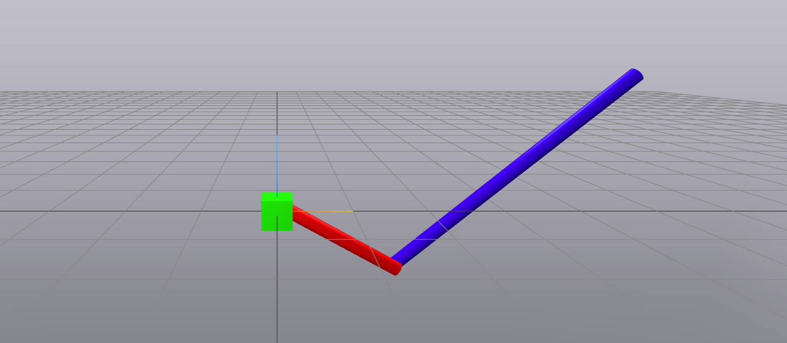
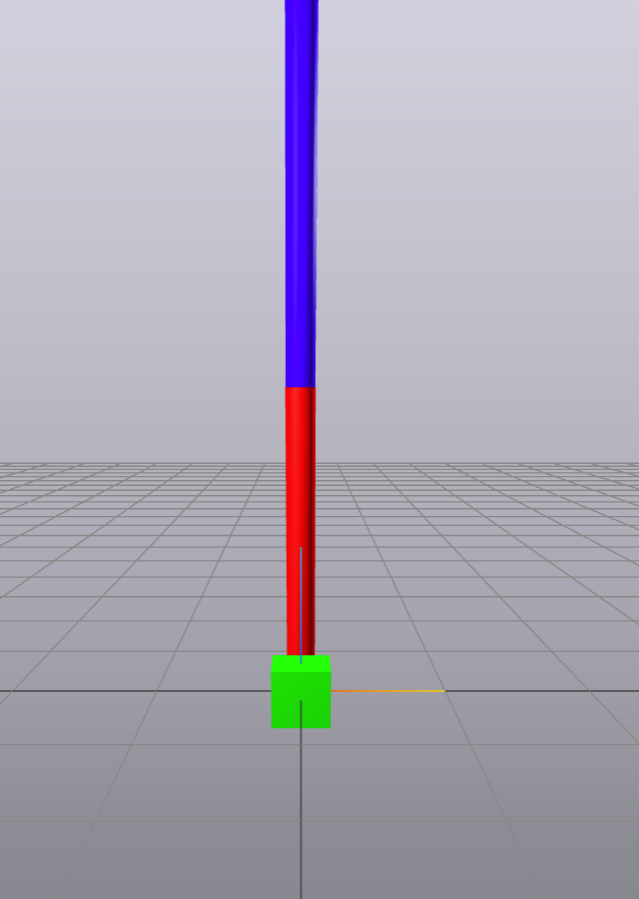

---
## 6. 结论与展望

本项目圆满完成了 Acrobot 欠驱动控制器的设计目标。通过能量成型与 LQR 的结合，克服了单电机无法直接控制肩关节的难题。实验证明，强有力的校直控制和严谨的角度回绕逻辑是缩短收敛时间的关键。未来可进一步探索基于时变轨迹优化的方法，以缩短泵能周期至 5 秒以内。

---

## 附录
### A.1 完整代码
#A.1.1 Deepnote链接 建议使用
本项目完整代码及运行环境已部署于 Deepnote，可通过以下链接直接访问并运行：
[点击跳转至 Acrobot 控制项目 - https://deepnote.com/workspace/lly-space-a2315645-917c-4196-b380-43fc4f6d2b75/project/03-Acrobots-Cart-Poles-and-Quadrotors-Duplicate-de71cef0-406f-4385-b8bc-5f4cd79581df/notebook/myacrobot-55a4c19553ea483b85bf6069ec085421?utm_content=de71cef0-406f-4385-b8bc-5f4cd79581df]
#A.1.2 .ipynb文件
本报告对应的完整 Jupyter Notebook 源文件请参考附件：
[my_acrobot.ipynb](./my_acrobot.ipynb)

### A.2 额外图表 / 数据
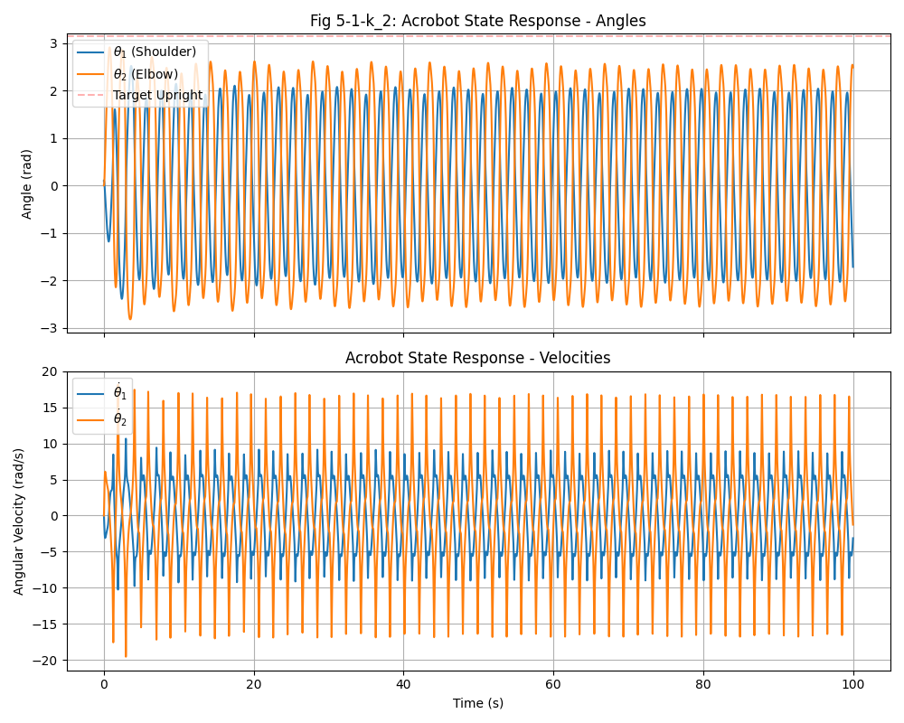
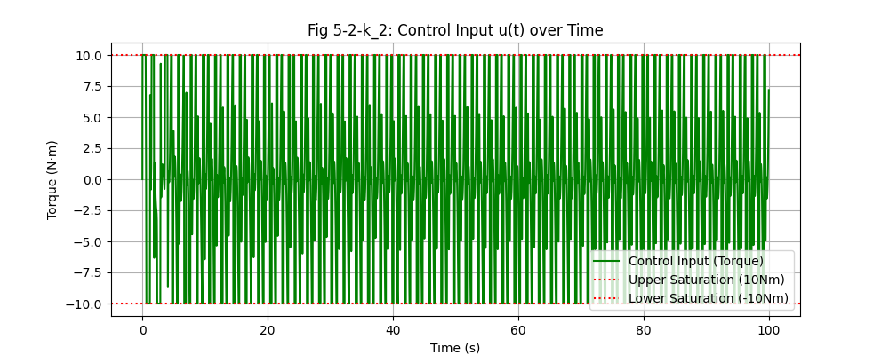
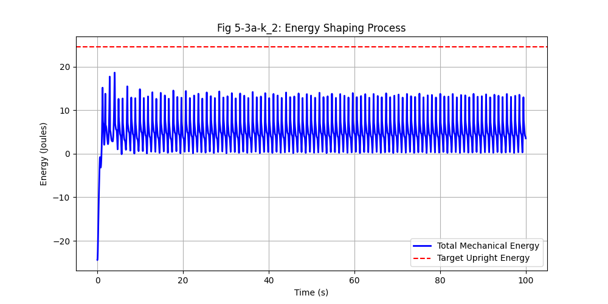
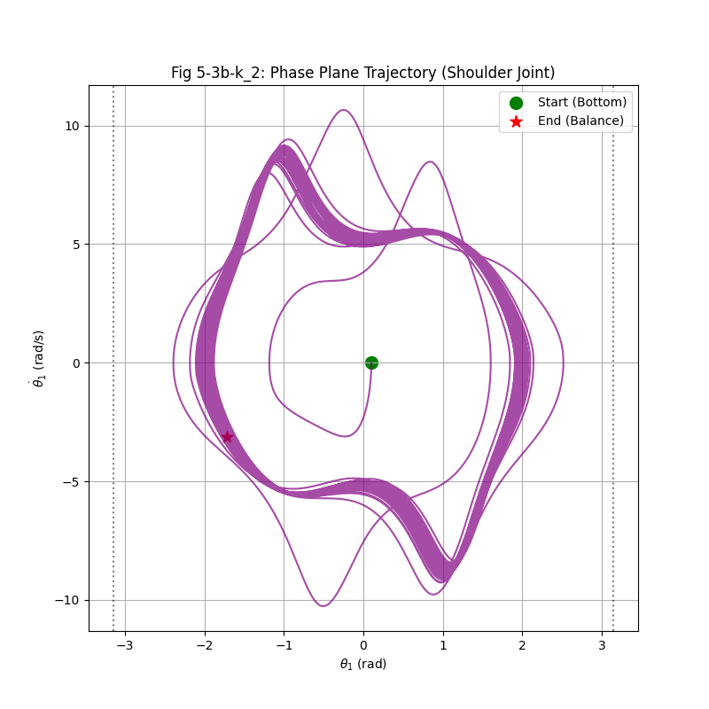
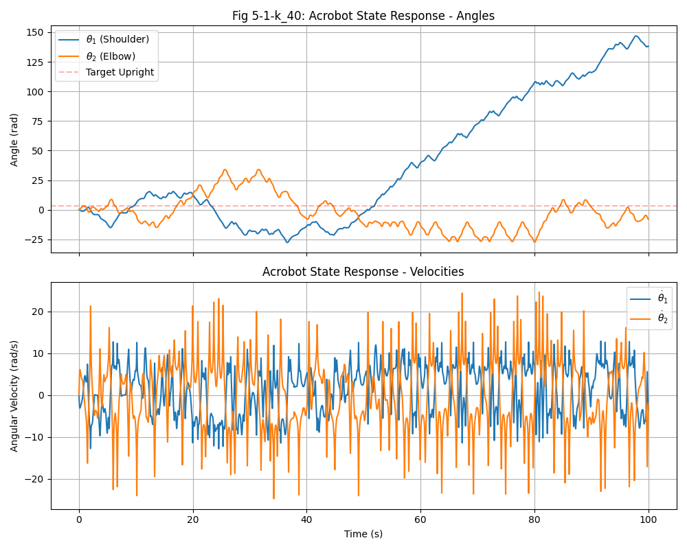
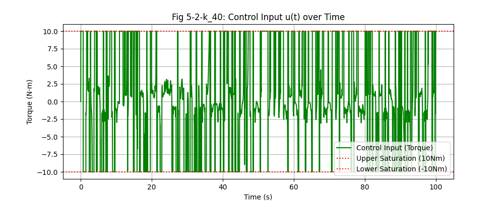
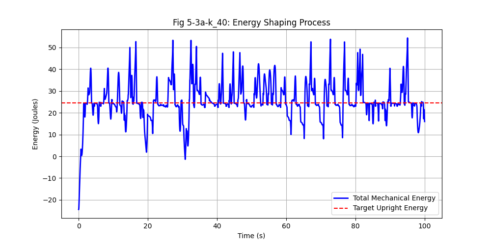
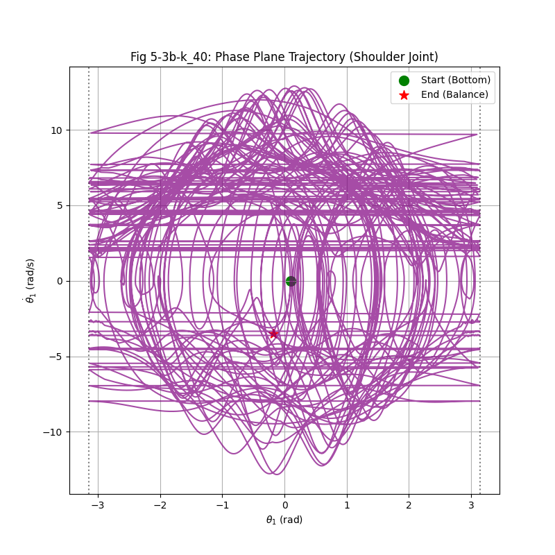

### A.3 关键代码片段
```python
# 角度回绕误差计算
    err_theta1 = (q1 - np.pi + np.pi) % (2.0 * np.pi) - np.pi
# 能量计算公式片段
    V = -m1 * g * lc1 * np.cos(q1) - m2 * g * (l1 * np.cos(q1) + lc2 * np.cos(q1 + q2))
    T = 0.5 * (M11 * q1d**2 + 2 * M12 * q1d * q2d + M22 * q2d**2)
#LQR关键参数
    # 设定权重矩阵
    Q = np.diag(([10.0, 10.0, 1.0, 1.0]))
    R = np.array([1.0])
#进入LQR与退出LQR，切换u(t)输入模式的关键
        # 判定是否满足【进入】LQR 的条件 (严一点)
        enter_lqr = np.abs(err_theta1) < 0.25 and np.abs(energy_error) < 1.0
        # 判定是否满足【离开】LQR 的条件 (松一点，防止反复横跳)
        exit_lqr = np.abs(err_theta1) > 0.5 or np.abs(energy_error) > 1.5
 # 【A 阶段：LQR 平衡控制】
        x_star = UprightState().CopyToVector()
        error_state = x - x_star
        # 对 theta1,theta2 做周期性修正
        error_state[0] = (error_state[0] + np.pi) % (2 * np.pi) - np.pi
        error_state[1] = (error_state[1] + np.pi) % (2 * np.pi) - np.pi
        u = -self.K_lqr.dot(error_state) 
# 【B 阶段：能量成型控制】 
        # 通过被动关节(肩部)的速度来决定泵能方向
        # 泵能律：当能量不足时，在利于能量增加的方向施加力矩
        k = 10
        if np.abs(energy_error) > 2.0:  # 当能量差距较大时，使用更激进的控制策略
            kp_straight = 15.0
            u_pump = k * np.tanh(2.0 * q1_dot) * energy_error
        else: 
            kp_straight = 15.0
            u_pump = k * q1_dot * energy_error

        # 直立律：当角度偏离时，施加力矩使角度趋近于直立
        kd_straight = 2.0
        u_straight = -kp_straight * q2 - kd_straight * q2_dot

        u = u_pump + u_straight
---
**提交 Checklist：**
- [x] 报告 PDF（已包含所有推导、分析）
- [x] 代码文件（`.ipynb` 已通过 Deepnote 验证）
- [x] 包含 5.2 节消融实验数据
- [x] 绘图具有完整轴标签与图注
---.